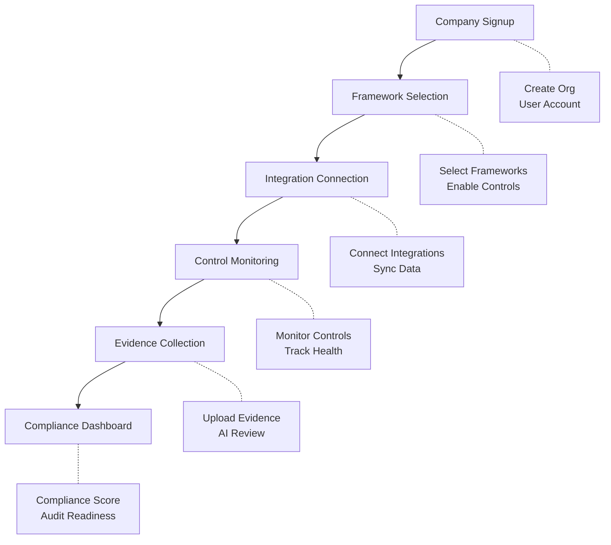

# Compliance Workflow Architecture Plan

## Overview

This document outlines the architecture for implementing a guided compliance workflow in the ComplySafe application. The workflow guides users through six key stages: Company Signup → Framework Selection → Integration Connection → Control Monitoring → Evidence Collection → Compliance Readiness Dashboard.

## Current State Analysis

### Existing Components
| Component | Location | Status |
|-----------|----------|--------|
| Onboarding Form | `src/app/onboarding/` | Partial - collects org info and framework |
| Dashboard | `src/app/dashboard/page.tsx` | Basic - shows KPIs, scans, risk heatmap |
| Frameworks API | `src/app/api/frameworks/` | Complete |
| Controls API | `src/app/api/controls/` | Complete |
| Evidence API | `src/app/api/evidence/` | Complete |
| Integrations API | `src/app/api/integrations/` | Complete |
| Monitoring API | `src/app/api/monitoring/` | Complete |

### Existing Database Models
- `Organization` - Company information
- `User` - User accounts
- `Framework` - Compliance frameworks (ISO27001, SOC2, HIPAA, PCI)
- `Control` - Compliance controls linked to frameworks
- `Evidence` - Evidence items linked to controls
- `Integration` - Third-party integrations

---

## Proposed Architecture

### Workflow Flow



### Page Structure

```
src/app/
├── (workflow)/
│   ├── layout.tsx          # Workflow-specific layout with progress stepper
│   ├── page.tsx           # Redirect to current step
│   ├── signup/
│   │   └── page.tsx       # Company signup form
│   ├── frameworks/
│   │   └── page.tsx       # Framework selection wizard
│   ├── integrations/
│   │   └── page.tsx       # Integration connection hub
│   ├── controls/
│   │   └── page.tsx       # Control monitoring dashboard
│   ├── evidence/
│   │   └── page.tsx       # Evidence collection center
│   └── readiness/
│       └── page.tsx       # Final compliance dashboard
```

### Component Breakdown

#### 1. Workflow Progress Stepper
- **File:** `src/components/workflow/WorkflowStepper.tsx`
- **Purpose:** Visual progress indicator showing all 6 stages
- **Features:**
  - Current step highlight
  - Completed step checkmarks
  - Clickable navigation to completed steps

#### 2. Company Signup Page
- **Existing:** `src/app/onboarding/OnboardingForm.tsx`
- **Enhancement:** Add company details form with validation
- **Fields:** Company name, industry, region, employee count
- **API:** `POST /api/orgs` (existing)

#### 3. Framework Selection Page
- **File:** `src/app/(workflow)/frameworks/page.tsx`
- **Purpose:** Multi-select framework selection with control preview
- **Features:**
  - Framework cards (ISO27001, SOC2, HIPAA, PCI)
  - Control count per framework
  - One-click enable
- **API:** `GET /api/frameworks`, `POST /api/frameworks/select`

#### 4. Integration Connection Page
- **File:** `src/app/(workflow)/integrations/page.tsx`
- **Purpose:** Connect third-party compliance tools
- **Integrations:**
  - AWS Security Hub
  - Azure Security Center
  - Google Cloud Security Command Center
  - GitHub
  - Jira
  - Slack
- **API:** `GET /api/integrations`, `POST /api/integrations/connect`

#### 5. Control Monitoring Page
- **File:** `src/app/(workflow)/controls/page.tsx`
- **Purpose:** Real-time control health monitoring
- **Features:**
  - Control status grid (Implemented, In Progress, Not Implemented)
  - Health trend charts
  - Risk alerts
  - Control owner assignment
- **API:** `GET /api/controls`, `GET /api/monitoring/control-health`

#### 6. Evidence Collection Page
- **File:** `src/app/(workflow)/evidence/page.tsx`
- **Purpose:** Upload and manage compliance evidence
- **Features:**
  - Drag-and-drop upload
  - AI evidence review
  - Expiration tracking
  - Control-evidence linking
- **API:** `POST /api/evidence/upload`, `GET /api/evidence`, `POST /api/evidence/ai-review`

#### 7. Compliance Readiness Dashboard
- **File:** `src/app/(workflow)/readiness/page.tsx`
- **Purpose:** Final compliance score and audit readiness
- **Features:**
  - Overall compliance score
  - Framework-specific breakdown
  - Audit timeline
  - Gap analysis
  - Export reports
- **API:** `GET /api/compliance/score`, `GET /api/dashboard/compliance`

---

## Implementation Plan

### Phase 1: Foundation
1. Create workflow layout with progress stepper
2. Create workflow route group
3. Add workflow navigation component

### Phase 2: Core Pages
4. Enhance company signup (reuse existing onboarding)
5. Build framework selection page
6. Build integration connection page

### Phase 3: Monitoring & Evidence
7. Build control monitoring page
8. Build evidence collection page
9. Build compliance readiness dashboard

### Phase 4: Polish
10. Add animations and transitions
11. Add validation and error handling
12. Add mobile responsiveness

---

## API Endpoints Required

| Endpoint | Method | Purpose |
|----------|--------|---------|
| `/api/orgs` | POST | Create organization |
| `/api/frameworks` | GET | List available frameworks |
| `/api/frameworks/select` | POST | Enable selected frameworks |
| `/api/integrations` | GET | List integrations |
| `/api/integrations/connect` | POST | Connect integration |
| `/api/controls` | GET | List controls |
| `/api/controls/[id]` | PATCH | Update control |
| `/api/evidence` | GET/POST | List/upload evidence |
| `/api/evidence/upload` | POST | Upload evidence file |
| `/api/evidence/ai-review` | POST | AI review evidence |
| `/api/compliance/score` | GET | Get compliance score |

---

## Success Criteria

- [ ] User can complete full workflow in 6 guided steps
- [ ] Each step has clear progress indication
- [ ] Data persists between steps
- [ ] Dashboard shows real-time compliance metrics
- [ ] Mobile-responsive design
- [ ] Existing APIs are leveraged without duplication
