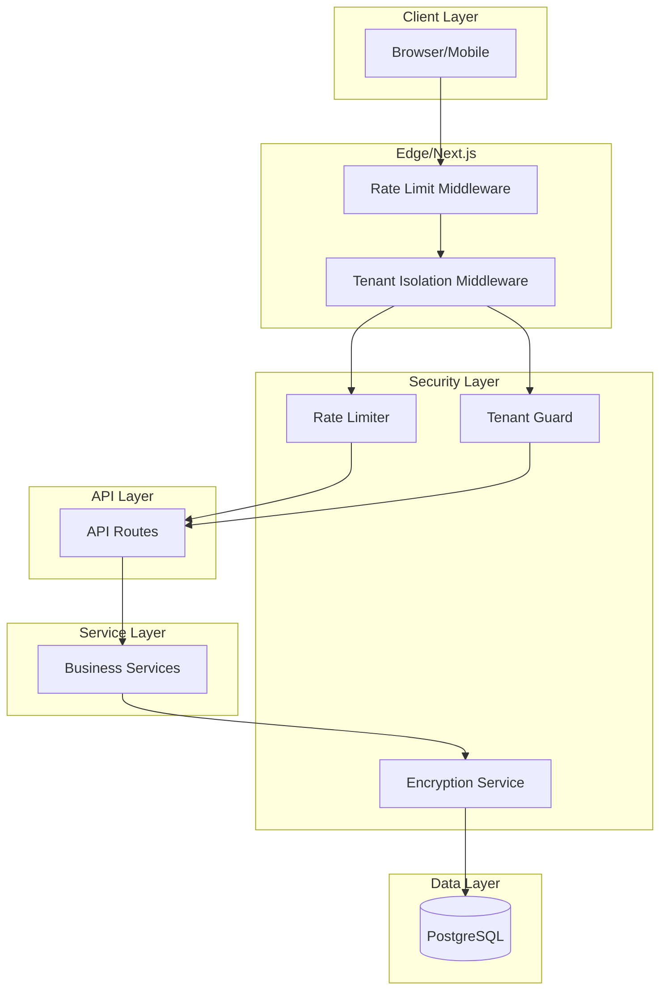

# Enterprise Security Implementation Plan

## Overview
ComplySafe needs enterprise-grade security features before launching as a SaaS product. This plan addresses the 3 critical security gaps identified:

1. **API Rate Limiting** - Prevent abuse and DoS attacks
2. **Tenant Isolation** - Ensure strict data separation between organizations
3. **Encryption Utilities** - Protect sensitive data at rest

---

## Current State Analysis

### What's Already Implemented
- ✅ Session-based authentication with HttpOnly cookies
- ✅ RBAC with 5 roles: owner, admin, compliance_manager, auditor, member
- ✅ Basic middleware for auth checks on /dashboard
- ✅ Prisma ORM with PostgreSQL

### What's Missing
- ❌ No API rate limiting
- ❌ No tenant isolation middleware
- ❌ No encryption for sensitive fields (API keys, tokens, PII)

---

## Implementation Plan

### 1. Rate Limiting

#### Files to Create
- `src/backend/security/rate-limit.ts` - In-memory rate limiter with sliding window
- `src/middleware.ts` - Update to include rate limiting

#### Implementation Details
```typescript
// Rate limit strategy: sliding window per organization
// Limits: 100 requests/minute for standard APIs, 1000 for read-heavy endpoints
// Use Redis-like in-memory store with cleanup
```

#### Todo List
- [ ] Create rate limiter utility with org-based limits
- [ ] Add rate limit headers to responses (X-RateLimit-Limit, X-RateLimit-Remaining)
- [ ] Update middleware to enforce rate limits
- [ ] Add rate limit bypass for health checks

---

### 2. Tenant Isolation

#### Files to Create
- `src/backend/security/tenant-guard.ts` - Enforce org boundaries on all queries
- `src/backend/db/tenant-query.ts` - Auto-filter queries by orgId
- `src/backend/middleware/tenant.ts` - Tenant context extraction

#### Implementation Details
```typescript
// All Prisma queries must include orgId filter
// Middleware extracts orgId from session and passes to request context
// Service layer receives orgId from request context
```

#### Todo List
- [ ] Create tenant context from session in middleware
- [ ] Add tenant guard to intercept unauthorized cross-tenant access
- [ ] Create database query helper that enforces orgId
- [ ] Add tenant validation to all API routes

---

### 3. Encryption Utilities

#### Files to Create
- `src/backend/security/encryption.ts` - AES-256 encryption/decryption
- `src/backend/security/key-management.ts` - Key rotation support
- `src/backend/security/fields.ts` - Field-level encryption decorators

#### Implementation Details
```typescript
// Use AES-256-GCM for authenticated encryption
// Environment variable for master key: ENCRYPTION_MASTER_KEY
// Support for field-level encryption in Prisma
// Key rotation capability for compliance
```

#### Todo List
- [ ] Create encryption utility with AES-256-GCM
- [ ] Add key management with rotation support
- [ ] Create encrypted field types for sensitive data
- [ ] Add encryption to Integration metadata (API keys, tokens)
- [ ] Add encryption to Evidence storage

---

## Architecture Diagram



---

## Priority Order

1. **Tenant Isolation** (Highest) - Data breach risk is critical
2. **Encryption** (High) - Compliance requirement for SOC2/ISO27001
3. **Rate Limiting** (Medium) - DoS protection, ensures fair usage

---

## Success Criteria

- [ ] All API routes enforce orgId filtering (tenant isolation)
- [ ] Rate limiting triggers 429 status when exceeded
- [ ] Sensitive integration metadata encrypted at rest
- [ ] Unit tests pass for all security components
- [ ] Security audit logging captures all access attempts

---

## Files to Modify

- `src/middleware.ts` - Add rate limiting and tenant context
- `src/app/api/*` - Ensure all routes use tenant guard
- `prisma/schema.prisma` - Add encrypted field types

---

## Files to Create

- `src/backend/security/rate-limit.ts`
- `src/backend/security/tenant-guard.ts`
- `src/backend/security/encryption.ts`
- `src/backend/security/key-management.ts`
- `src/backend/middleware/tenant.ts`
